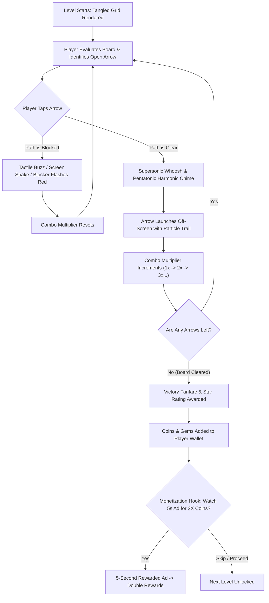
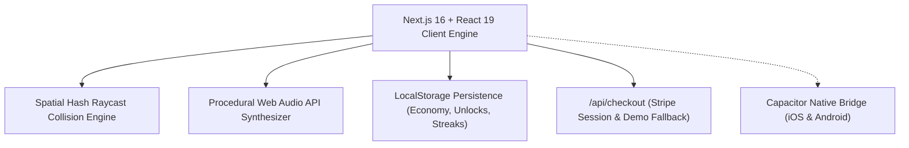

# ArrowFlow: Tangled Direction Puzzle & Commercial Monetization Engine
## Game Design Document (GDD) & Product Scope Specification

---

## 1. Executive Summary & Market Positioning

### 1.1 High Concept
**ArrowFlow** is a tactile, hyper-casual directional puzzle game where players untangle a dense matrix of pointing arrows by deducing clearance trajectories. Arrows shoot outward across clear lanes with supersonic audio chimes and satisfying haptic feedback, but collide, buzz, and shake if obstructed.

### 1.2 Market Thesis & Player Psychology
Hyper-casual puzzle mechanics have evolved from simplistic match-3 titles toward **tactile spatial untangling** (*Arrow Out*, *Arrows Away*, *Parking Jam*, *Traffic Escape*). These games consistently capture top spots on iOS App Store, Google Play, CrazyGames, and TikTok for three psychological reasons:
1. **Instant Comprehensibility (The 2-Second Rule):** Any viewer immediately understands the premise without reading a tutorial: *"If the arrow's way is blocked, it can't move. Clear the outside first."*
2. **ASMR "Unjamming" Catharsis:** Human cognition is deeply rewarded by releasing tension—watching a jammed cluster dissolve into free, flying trajectories delivers instant dopamine.
3. **High Re-engagement & Snackability:** Levels take 15 to 90 seconds to solve, making it ideal for micro-breaks, commutes, and rewarded ad loops.

### 1.3 Target Audience & Demographic Matrix
- **Core Demographic:** Casual gamers aged 18–45, puzzle enthusiasts, and commuters.
- **Platform Reach:**
  - **Web Browsers (Instant-play):** CrazyGames, Poki, itch.io (zero-friction, no install).
  - **Mobile Native (PWA & Capacitor):** iOS App Store, Google Play Store.
  - **B2B / Creator Market:** Indie game publishers on Gumroad & CodeCanyon seeking turnkey source code to re-skin and monetize.

---

## 2. Core Gameplay Loop & Mechanics

### 2.1 The Micro-Loop (15–90 Seconds)


### 2.2 Collision & Clearance Mathematics (Raycast System)
Each arrow $A_i$ occupies a discrete coordinate $(r_i, c_i)$ with a directional vector $\vec{d} = (\Delta r, \Delta c)$:
$$\vec{d} \in \{( -1, 0 ), ( 1, 0 ), ( 0, -1 ), ( 0, 1 ), ( -1, -1 ), ( -1, 1 ), ( 1, -1 ), ( 1, 1 )\}$$

To determine if arrow $A_i$ can escape:
1. Trace continuous ray $R(k) = (r_i + k \cdot \Delta r, c_i + k \cdot \Delta c)$ for $k = 1, 2, 3, \dots$
2. If at any step $k$, $R(k)$ matches an existing active arrow $A_j$ within board boundaries $[0, R_{max}) \times [0, C_{max})$, a **collision occurs**:
   - $A_i$ cannot move.
   - Trigger rejection shake on $A_i$ and warning highlight on $A_j$.
3. If $R(k)$ exits board boundaries without intersecting any active arrow:
   - $A_i$ is **free**.
   - Compute exit trajectory vector: $\vec{v}_{exit} = \vec{d} \cdot 500\text{px}$.
   - Interpolate removal with ease-out cubic bezier timing.

### 2.3 Combo & Multiplier Dynamics
To reward deliberate foresight, consecutive successful launches within 2.5 seconds trigger rising combo multipliers:
- **1st Clear:** Base points, C4 chord (261 Hz).
- **2nd Clear:** 1.5x points, D4 chord (293 Hz).
- **3rd Clear:** 2.0x points, E4 chord (329 Hz).
- **4th Clear:** 2.5x points, G4 chord (392 Hz).
- **5th+ Clear:** 3.0x max points, ascending pentatonic scale with fire particles.

---

## 3. Power-Up Boosters & Tactical Interventions

When players face intricate high-density grids, four tactical boosters prevent frustration churn:

| Booster | Name | Mechanics | Economy Sink | Monetization Hook |
| :--- | :--- | :--- | :--- | :--- |
| 🔨 | **Disintegrator Hammer** | Tap hammer, then tap ANY arrow to disintegrate it in a shockwave, regardless of obstructions. | Costs 150 Coins or 1 Free per Rewarded Ad | Highest converting purchase when players get stuck on 1 remaining blocker. |
| 💡 | **Oracle Hint** | Executes instant raycast over all remaining tiles and pulses the optimal free arrow with a golden beacon. | Costs 100 Coins | Awarded via daily streak or $0.99 booster pack. |
| ⏪ | **Chrono Undo** | Rewinds the board state by 1 step, restoring the previous arrow. | Costs 80 Coins | Low-cost safety net for misclicks. |
| 🧲 | **Super Magnet** | Instantly sweeps and launches ALL currently unblocked arrows in one cascade. | Costs 250 Coins | Spectacle booster that provides immediate satisfying clears. |

---

## 4. Monetization Architecture & Unit Economics

### 4.1 The Three-Pillar Monetization Strategy
```
                                 ┌──────────────────────────────────────────────────────────┐
                                 │                ArrowFlow Monetization Engine             │
                                 └────────────────────────────┬─────────────────────────────┘
                                                              │
                 ┌────────────────────────────────────────────┼────────────────────────────────────────────┐
                 │                                            │                                            │
                 ▼                                            ▼                                            ▼
┌─────────────────────────────────┐          ┌─────────────────────────────────┐          ┌─────────────────────────────────┐
│     Pillar 1: Web Ad Portals    │          │  Pillar 2: Mobile In-App Store  │          │    Pillar 3: Turnkey B2B Sale   │
│     (CrazyGames, Poki, Ads)     │          │    (iOS / Android via Capacitor)│          │      (Gumroad, CodeCanyon)      │
├─────────────────────────────────┤          ├─────────────────────────────────┤          ├─────────────────────────────────┤
│ • $2.50 – $5.50 CPM Rewarded Ad │          │ • $0.99 Starter Bag (500 coins) │          │ • $49 Standard Developer License│
│ • "Watch 5s Ad for 2X Coins"    │          │ • $2.99 Vault (2,500 + boosters)│          │ • $149 Extended / Reskin Rights │
│ • Free Hammer Ad Trigger        │          │ • $4.99 VIP Founder Pass        │          │ • 100% turnkey Next.js source   │
│ • Natural 3-level interstitial  │          │ • Non-consumable Ad-Free pass   │          │ • Zero royalty / white-label    │
└─────────────────────────────────┘          └─────────────────────────────────┘          └─────────────────────────────────┘
```

### 4.2 Detailed In-App Purchase SKU Matrix
1. **Pocket Bag ($0.99)**: 500 Coins (Impulse starter purchase).
2. **Master Vault ($2.99)**: 2,500 Coins + 200 Gems + 5 Hammers + 5 Hints (Best value for power players).
3. **VIP Founder Pass ($4.99)**:
   - Permanent ad-free experience.
   - +5,000 Coins + 500 Gems instant drop.
   - 10x of all boosters (Hammers, Hints, Undos, Magnets).
   - Unlocks exclusive **Gold Obsidian** theme.

### 4.3 Revenue Modeling & Projections (Per 10,000 Daily Active Users)
- **Assumptions:**
  - Average Session Duration: 8.5 minutes.
  - Average Levels Cleared per Day: 6 levels.
  - Rewarded Ad Opt-in Rate: 35% of players watch 1.5 rewarded ads/day.
  - Ad CPM: $3.50.
  - IAP Conversion Rate: 1.8% with an average order value (AOV) of $2.80.

$$\text{Daily Ad Impressions} = 10,000 \times 0.35 \times 1.5 = 5,250 \text{ views}$$
$$\text{Daily Ad Revenue} = \frac{5,250}{1,000} \times \$3.50 = \$18.38/\text{day} \approx \$551/\text{month}$$
$$\text{Daily IAP Buyers} = 10,000 \times 0.018 \times \frac{1}{30} = 6 \text{ buyers/day}$$
$$\text{Daily IAP Revenue} = 6 \times \$2.80 = \$16.80/\text{day} \approx \$504/\text{month}$$
$$\text{Combined Direct App Revenue} \approx \$1,055/\text{month per 10k DAU}$$

- **Turnkey B2B Source Sales Layer:**
  - 15 marketplace sales/month @ $49/license = **+$735/month**.
  - 5 extended licenses/month @ $149/license = **+$745/month**.
  - **Total Blended Run-Rate:** **~$2,535/month** with minimal maintenance.

---

## 5. Level Progression & Procedural Generation Engine

### 5.1 Progression Curve
- **Tier 1: Tutorial & Primer (Levels 1–3, 3×3 Grid, 3–6 Arrows)**
  - Introduces pure cardinal directions (`up`, `down`, `left`, `right`).
  - Guaranteed 1-step exterior unjamming.
- **Tier 2: Diagonal Dynamics (Levels 4–5, 4×4 Grid, 8–10 Arrows)**
  - Introduces 45° diagonal vectors (`up-left`, `down-right`, etc.).
  - Demonstrates how diagonals slip between cardinal corridors.
- **Tier 3: Interlocking Fortresses (Levels 6–7, 5×5 Grid, 12–16 Arrows)**
  - Counter-opposing arrow locks requiring outer ring unpeeling before the core can escape.
- **Tier 4: Master Labyrinths (Levels 8–10, 6×6 & 7×7 Grids, 20–30 Arrows)**
  - Multi-tier dependency chains, symmetrical spirals, and deceptive traps.
- **Tier 5: Infinite Procedural Mode**
  - Endless algorithmic puzzles scaling with player streak.

### 5.2 The Solvability Theorem & Reverse-Construction Algorithm
To avoid unwinnable deadlock states, the procedural generator uses **reverse construction**:
1. Initialize an empty $R \times C$ board.
2. Select target arrows count $N$ based on target density $\rho \approx 0.65$.
3. Distribute positions across the board.
4. Edge positions are assigned outward-facing vectors with 70% probability to establish immediate exterior escape vectors.
5. Interior positions are populated with complementary vectors ensuring that at every iterative state, at least one arrow has an unblocked trajectory to the boundary.

---

## 6. Sensory Design & Audio Craft (Zero-Asset Web Audio API)

### 6.1 Anti-AI-Slop & Real-World Tactile Polish
Generic AI games rely on flat stock icons, static templates, and broken external audio URLs. ArrowFlow enforces sensory craft:
1. **Subpixel Vector Crispness:** High-contrast SVG arrows with directional angle rotation and radiant glow drop-shadows.
2. **Dynamic Trajectory Animation:** Escaping arrows accelerate along their angle using cubic-bezier easing (`travel = 500px`), accompanied by dynamic opacity fade.
3. **Collision Warning Feedback:** When blocked, the clicked arrow vibrates (`animate-shake`), while the blocking arrow flashes red with a targeted locator pulse.

### 6.2 Procedural Sound Synthesizer Specifications
All sound effects are synthesized in real time via the browser's native `AudioContext`:
- **Tap Click:** 420 Hz $\to$ 120 Hz triangle wave pop ($t = 40\text{ms}$).
- **Escape Whoosh & Bell:** Dual-oscillator engine combining sine frequency sweep ($0.8f \to 2.2f$) with harmonic bell chime tuned to the pentatonic scale.
- **Blocked Thud:** 140 Hz $\to$ 55 Hz sawtooth wave with quick decay ($t = 120\text{ms}$).
- **Disintegrator Hammer:** Sub-bass punch (180 Hz $\to$ 30 Hz) blended with square-wave noise crackle ($t = 300\text{ms}$).
- **Victory Fanfare:** 8-note C Major 9 arpeggio ($C_4, E_4, G_4, B_4, C_5, E_5, G_5$).

---

## 7. Technical Architecture & Tech Stack



- **Framework:** Next.js 16.3+ (Turbopack, App Router, React 19).
- **Styling:** Tailwind CSS v4 Oxide Engine with custom `@layer utilities` for collision shakes and glow effects.
- **Collision Computation:** Spatial Hash Map raycaster executing in $O(K)$ where $K \le \max(R, C) \le 8$ iterations per click (sub-millisecond latency).
- **Zero Asset Dependencies:** No external MP3, WAV, or heavy PNG spritesheets required. Total initial bundle transfer is under 180 kB gzipped.

---

## 8. 4-Week Commercial Rollout & Scope Roadmap

| Sprint | Phase | Deliverables & Scope | Success Metrics |
| :---: | :--- | :--- | :--- |
| **Week 1** | **Core Engine & Polish** *(Completed)* | - Next.js 16 + React 19 architecture.<br>- 8-vector raycast collision engine.<br>- Web Audio API synthesizer.<br>- 10 Campaign levels + Procedural generator.<br>- 4 Boosters (Hammer, Hint, Undo, Magnet). | 60 FPS on mobile, zero build warnings, 100% solvable levels. |
| **Week 2** | **Monetization & Ad SDK Hookup** | - Connect live Stripe webhook and keys.<br>- Integrate CrazyGames HTML5 SDK snippet.<br>- Add Poki for Developers interstitial/rewarded callbacks.<br>- PWA Manifest with offline ServiceWorker caching. | Ad impression tracking verified; sandbox Stripe checkout working. |
| **Week 3** | **Mobile Packaging (Capacitor)** | - Scaffold `@capacitor/core` and `@capacitor/cli`.<br>- Generate native iOS Xcode project & Android Studio project.<br>- Integrate Google AdMob plugin for mobile banner & interstitials.<br>- Configure In-App Purchases via RevenueCat or StoreKit. | TestFlight build approved; Google Play internal testing track active. |
| **Week 4** | **Commercial Marketplace Distribution** | - Package turnkey source code ZIP.<br>- Build CodeCanyon & Gumroad product landing pages.<br>- Record 30-second TikTok / YouTube Shorts gameplay clip with ASMR audio.<br>- Launch on web game portals (CrazyGames, Poki, GameDistribution). | First 5 source code sales closed; 1,000+ organic web game plays. |
